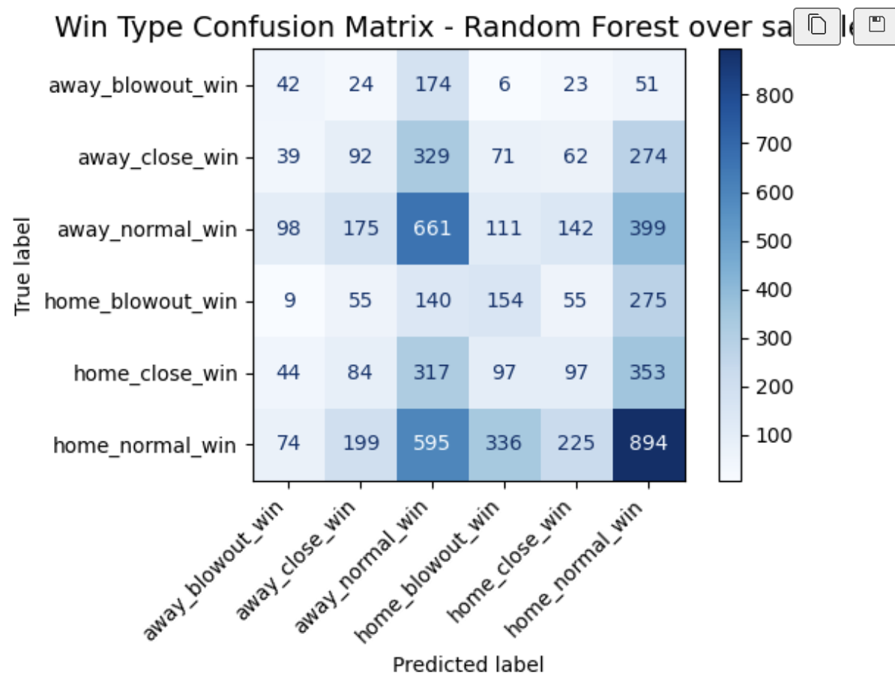

# NBA Game Outcome Classification

Predicting the *type* of NBA game outcome: Close, normal, or blowout (win or
loss) from a team's recent form as a 6-class classification problem. A study in
careful feature engineering and honest evaluation on a difficult prediction
task.



## Problem

Given two teams' recent performances *before* a game is played, can we predict how
the game will turn out, not just who wins, but by how much? Outcomes are bucketed
into six classes (close/normal/blowout, win/loss) derived from the final point
differential. The goal of the project is to do this rigorously with leak-free
features and honest evaluation, rather than to chase a high score on what turns
out to be a hard problem.

## Approach

**Data.** NBA box-score data [Kaggle dataset](https://www.kaggle.com/datasets/szymonjwiak/nba-traditional), 
covering seasons from 1997 onward.

**Feature engineering with leakage prevention.** Team form is captured with
10-game rolling averages, computed with strict temporal ordering. Each game's
features use only games that occurred *before* it (shifted windows), reset at
season boundaries, with the prior season's average filling the first few games of
each season. From these, I derived advanced metrics: true shooting %, effective
field goal %, assist-to-turnover ratio, free-throw rate, offensive-rebound rate,
and a possession-based pace estimate.

**Feature selection.** Highly correlated and redundant features were pruned via a
correlation map, and the final feature set was chosen using mutual information
against the target to capture non-linear relationships, not just linear
correlation.

**Class imbalance.** The six classes are imbalanced (normal games dominate). I
compared several strategies across different models: class weighting, random over and
under-sampling, and sample weighting, rather than assuming one approach.

**Models.** Decision tree, random forest, XGBoost (hyperparameter-tuned via grid
search), and a deep neural network, compared on macro-F1 to account for the
imbalance.

## A note on data leakage

Preventing temporal leakage was a focus throughout. The rolling features are
leak free by construction (shifted windows). During review I also caught a subtler
leak: an early version computed season-adjusted pace and 3-point-rate features
using each season's *full-season* average, which includes games that happen after
the one being predicted. I removed those adjusted features and kept the leak-free
un-adjusted versions.

## Results

The best model (Random Forest with oversampling) achieved a **macro-F1 of 0.22** on the test set.

Two honest findings:

- **Tree-based models outperformed the deep neural network.** Despite trying
  multiple architectures (ReLU, LeakyReLU, ELU) up to nine layers, the neural
  network did not beat the tree based models.
- **The overall predictive signal is modest.** Even the best model achieves only
  limited accuracy, which indicates that pre-game team averages carry limited
  information about *how* a game will play out. Much of the variance in game
  outcomes is not recoverable from box-score form alone.


## Limitations & next steps

- Outcome severity is inherently noisy; box-score averages capture team strength
  but not matchup-specific or in-game factors (injuries, rest, motivation).
- Player-level features or opponent-adjusted ratings could add signal beyond
  team aggregates.
- The deep network was over-parameterized relative to the modest number of tabular features.
  A simpler model would likely perform comparably.

## Tech stack

Python · XGBoost · scikit-learn · TensorFlow/Keras · imbalanced-learn · Pandas · NumPy

## Running it

1. **Clone and enter the repo:**
```bash
git clone https://github.com/joshinordee/nba_game_prediction
cd nba_game_prediction
```

2. **Create and activate a virtual environment:**
```bash
python3 -m venv venv
source venv/bin/activate        # Windows: venv\Scripts\activate
```

3. **Install dependencies:**
```bash
pip install -r requirements.txt
```

4. **Run the notebook.** Open `win_margin_prediction.ipynb` in Jupyter or an
IDE, select the `venv` environment as the kernel, and run all cells
(Kernel → Restart & Run All).

> If your IDE doesn't list the `venv` kernel, point it at
> `venv/bin/python` inside the project folder directly.

The dataset (`data/team_traditional.csv`) is included in the repo, so no
additional downloads are required.